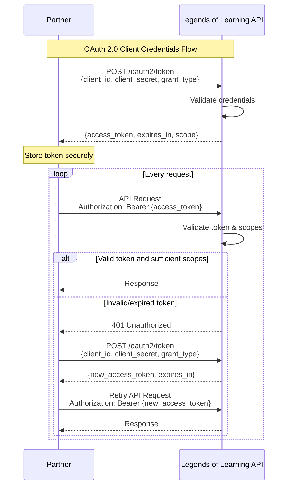
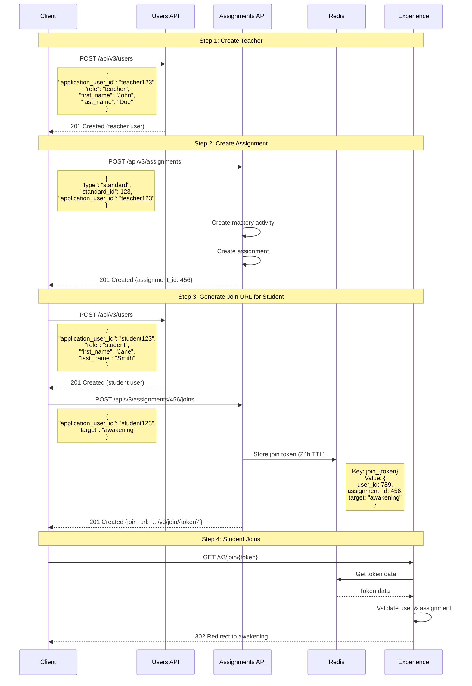

# Legends of Learning - Partner Integration

This document outlines the integration between Legends of Learning (LoL) and Partner platforms, covering security, authentication, and available APIs.

## Table of Contents
1. [Getting Started](#getting-started)
   - [Application Registration](#1-application-registration)
   - [Authentication Flow](#2-authentication-flow)
2. [Security Model](#security-model)
   - [OAuth 2.0 Implementation](#oauth-20-implementation)
   - [Scope System](#scope-system)
3. [Assignment API](#assignment-api)
   - [Overview](#overview)
   - [Complete Flow](#complete-flow)
   - [Endpoints](#endpoints)
   - [Assignment Creation](#assignment-creation)
   - [Join URL Generation](#join-url-generation)
   - [Error Handling](#error-handling)
   - [Authentication and Security](#authentication-and-security)
   - [Implementation Notes](#implementation-notes)
4. [API Reference](#api-reference)
   - [Base URLs and Authentication](#base-urls-and-authentication)
   - [Authentication Flow](#authentication-flow)
   - [Scope System](#scope-system-1)
   - [Content API](#content-api)
     - `GET /api/v3/content`
     - `GET /api/v3/content/:id`
     - `GET /api/v3/content/:id/reviews`
   - [Assignment Management](#assignment-management)
     - `POST /api/v3/assignments`
     - `POST /api/v3/assignments/:id/joins`
   - [User Management](#user-management)
     - `GET /api/v3/users`
     - `POST /api/v3/users`
     - `GET /api/v3/users/:id`
     - `PUT /api/v3/users/:id`
   - [Standards Management](#standards-management)
     - `GET /api/v3/standard_sets`
     - `GET /api/v3/standard_sets/:id/standards`
   - [Search API](#search-api)
     - `POST /api/v3/searches`
   - [OAuth Endpoints](#oauth-endpoints)
     - `POST /api/v3/oauth2/token`
     - `POST /api/v3/oauth2/revoke`
5. [Integration Guidelines](#integration-guidelines)
   - [Best Practices](#best-practices)
   - [Common Patterns](#common-patterns)
6. [Implementation Notes](#implementation-notes)
   - [Authentication Pipeline](#authentication-pipeline)
   - [Error Handling](#error-handling)
   - [CDN Integration](#cdn-integration)
7. [Support](#support)

## Getting Started

### 1. Application Registration

1. Contact the Legends of Learning team to register your application
2. Provide:
   - Application name
   - Brief description
   - Contact information
   - Redirect URLs (if applicable)
   - Expected usage volume

### 2. Authentication Flow

1. Obtain credentials (after approval):
   - Client ID
   - Client Secret (⚠️ Keep secure, never expose in client-side code)

2. Get access token:
```http
POST /api/v3/oauth2/token
Content-Type: application/x-www-form-urlencoded

grant_type=client_credentials&
client_id=YOUR_CLIENT_ID&
client_secret=YOUR_CLIENT_SECRET
```

Response:
```json
{
  "access_token": "...",
  "token_type": "bearer",
  "expires_in": 3600,
  "scope": "public:read content:read ..."
}
```

3. Use token in API requests:
```http
GET /api/v3/content
Authorization: Bearer YOUR_ACCESS_TOKEN
```

## Security Model

### OAuth 2.0 Implementation

The integration uses OAuth 2.0 with Client Credentials flow, ensuring secure communication between platforms. Each application receives its own set of credentials and can only access its own users and data.



### Scope System

Hierarchical permission structure:
- Base: `public:read` (included in all tokens)
- Hierarchy: `api:access` → `access` → `write` → `read`

Available scopes:
- `content:read` - Content access
- `content_reviews:read` - Review access
- `standards:read` - Standards access
- `assignments:write` - Assignment management
- `assignment_joins:write` - Assignment join management
- `users:read/write` - User management
- `searches:write` - Search functionality
- `api:access` - Full access
- `test:read` - Test endpoints

### User Management
- `GET /api/v3/users`
- `POST /api/v3/users`
- `GET /api/v3/users/:id`
- `PUT /api/v3/users/:id`

Key Features:
- User creation is idempotent when using identical parameters
- Username format: `{application.owner.code}-{application_user_id}`
- Teacher users automatically get email: `{application.owner.code}-{application_user_id}@example.com`
- Cannot update `application_user_id` after creation
- Cannot change user role after creation
- Each application can only access its own users

### Assignment Management
- `POST /api/v3/assignments`
- `POST /api/v3/assignments/:id/joins`

Key Features:
- Assignment creation automatically creates an awakening activity of type "mastery"
- Join URLs use a Redis-based token system
- Join URL format: `/v3/join/{token}`
- Join payload requires a "target" field (e.g. "awakening")

### Content API
Base URL: `/api/v3/content`
Required Scope: `content:read`

Content Review Visibility Rules:
- Reviews from validated teachers are shown
- Reviews from testers are shown
- Reviews from manually approved teachers are not shown

Review Stats Include:
- `teacher_rating_avg`
- `teacher_rating_count`
- `student_rating_avg`
- `student_rating_count`
- `ease_of_play_avg`
- `content_integration_avg`
- `composite_rating_score`
- `composite_rating_avg`
- `suggested_use_summary`

### Standards Management
Base URL: `/api/v3/standard_sets`
Required Scope: `standards:read`

Standard Set Structure:
- Standard Sets have a `public` boolean field
- Standards are organized by subjects with:
  - `subject_area`
  - `grade_level`
- Learning objectives include:
  - `question_count`
  - `image_key`
  - `ngss_dci_name`

## Assignment API

### Overview
The Assignment API provides endpoints for creating assignments and generating join URLs for students. This system replaces the previous launch system with a more direct two-step process:
1. Create an assignment
2. Generate join URLs for student access

### Complete Flow



### Endpoints

1. **Create Assignment**
```http
POST /api/v3/assignments
```

Required Scope: `assignments:write`

Request Body:
```json
{
  "type": "standard",
  "standard_id": "integer",
  "application_user_id": "string"
}
```

Response (201 Created):
```json
{
  "assignment_id": "integer"
}
```

2. **Create Join URL**
```http
POST /api/v3/assignments/:id/joins
```

Required Scope: `assignment_joins:write`

Request Body:
```json
{
  "application_user_id": "string",
  "target": "awakening"
}
```

Response (201 Created):
```json
{
  "join_url": "string"
}
```

### Assignment Creation

When creating an assignment:
- Creates a mastery-type awakening activity
- Associates it with the specified standard
- Sets up a classic playlist mode assignment
- Default duration is 7 days from creation
- Assignment name is generated from the standard's learning objective

### Join URL Generation

The join URL system:
- Creates unique tokens for each student-assignment combination
- Stores join data in Redis with 24-hour TTL
- Join token data includes:
  - User ID
  - Assignment ID
  - Target platform

### Error Handling

1. **HTTP Status Codes**
   - 201: Created (successful creation)
   - 403: Forbidden (insufficient permissions)
   - 404: Not Found (assignment not found)
   - 422: Unprocessable Entity (validation errors)

2. **Error Response Format**
   ```json
   {
     "error": "Detailed error message"
   }
   ```
   or for validation errors:
   ```json
   {
     "errors": {
       "field": "error message"
     }
   }
   ```

3. **Common Error Scenarios**
   - Standard not found
   - User not found
   - Invalid target value
   - Missing required parameters
   - Insufficient permissions
   - Assignment not found

### Authentication and Security

1. **Authentication Requirements**
   - OAuth2 Bearer token required
   - Application context preserved
   - User must exist in the system

2. **Required Scopes**
   - `assignments:write` for creating assignments
   - `assignment_joins:write` for creating join URLs

### Implementation Notes

1. **Assignment Creation**
   ```json
   {
     "name": "Focus on Standard Name",
     "description": "Standard focus mode for Standard Name",
     "mode": "classic_playlist",
     "start_time": "2024-03-07T00:00:00Z",
     "end_time": "2024-03-14T00:00:00Z",
     "activities": [
       {
         "type": "awakening_activity",
         "learning_objective_id": 123,
         "order": 0
       }
     ]
   }
   ```

2. **Join URL Format**
   ```
   {base_url}/v3/join/{token}
   ```
   where token is a Base64-encoded random string

3. **Redis Storage**
   - Key format: `join_{token}`
   - TTL: 24 hours
   - Stored data:
     ```json
     {
       "user_id": 123,
       "assignment_id": 456,
       "target": "awakening"
     }
     ```

## API Reference

### Base URLs and Authentication

All API endpoints, including OAuth endpoints, are under `/api/v3`:

1. **OAuth Endpoints** - `/api/v3/oauth2/*`
   - Authentication and token management
   - No authentication required
   - Examples:
     - `/api/v3/oauth2/token` - Token generation
     - `/api/v3/oauth2/revoke` - Token revocation

2. **Resource Endpoints** - `/api/v3/*`
   - All other functionality
   - Requires OAuth 2.0 Bearer token
   - Examples:
     - `/api/v3/content`
     - `/api/v3/users`
     - `/api/v3/searches`

### Authentication Flow

The API uses two distinct pipelines:

1. **OAuth Pipeline** (`/api/v3/oauth2/*`)
   - Token generation and revocation
   - Basic JSON parsing
   - No authentication required

2. **API Pipeline** (`/api/v3/*`)
   - Basic JSON parsing
   - OAuth 2.0 Bearer token verification
   - Authentication validation
   - Application context validation

### Scope System

The API implements a hierarchical scope system:

Base Scope:
- `public:read` (automatically included in all tokens)

Permission Hierarchy:
```
api:access → access → write → read
```

Available Resource Scopes:
```elixir
@resources ~w(api test content reviews standards assignments assignment_joins users)
```

Each resource follows the permission hierarchy. For example:
- `content:read` - Basic content access
- `content:write` - Content modification (implies read)
- `content:access` - Full content access (implies write and read)

### Content API
Base URL: `/api/v3/content`
Required Scope: `content:read`

#### Content Types
Content type is determined by the following logic:
```elixir
CASE
  WHEN content_type = 'simulation' THEN 'simulation'
  WHEN content_type = 'video' THEN 'video'
  WHEN question_game = true THEN 'question'
  ELSE 'instructional'
END
```

#### Endpoints

1. **List Content**
```http
GET /api/v3/content
```

Query Parameters:
| Parameter | Type | Default | Description |
|-----------|------|---------|-------------|
| page | integer | 1 | Page number |
| page_size | integer | 20 | Items per page |
| standard_ids | array[integer] | null | Filter by standards |
| game_type | string | null | Filter by type (simulation, video, question, instructional) |
| content_type | string | null | Filter by raw content type |
| supports_tts | boolean | null | Filter by TTS support |
| supports_ipad | boolean | null | Filter by iPad support |
| multi_language | boolean | null | Filter by language support |
| saves_progress | boolean | null | Filter by progress saving |
| ids | array[integer] | null | Filter by specific IDs |

Response:
```json
{
  "entries": [
    {
      "id": "integer",
      "game": "string",
      "image": "string",  // Prefixed with CDN base URL
      "description": "string",
      "estimated_duration": "integer",
      "type": "string",
      "content_type": "string",
      "supports_ipad": "boolean",
      "supports_tts": "boolean",
      "video_preview_url": "string",
      "version": {
        "id": "integer",
        "url": "string",
        "language_key": "string",
        "api_version": "string"
      },
      "audience": {
        "g1": "boolean",
        "g2": "boolean",
        // ... through g12 and k
      },
      "banner": "string",
      "stat": {
        "teacher_rating_avg": "float",
        "teacher_rating_count": "integer",
        "student_rating_avg": "float",
        "student_rating_count": "integer",
        "ease_of_play_avg": "float",
        "content_integration_avg": "float",
        "composite_rating_score": "float",
        "composite_rating_avg": "float",
        "suggested_use_summary": "string"
      }
    }
  ],
  "page_number": "integer",
  "page_size": "integer",
  "total_pages": "integer",
  "total_entries": "integer"
}
```

2. **Get Content Details**
```http
GET /api/v3/content/:id
```

Response includes all fields from list endpoint plus:
```json
{
  "is_available": "boolean",
  "vocabulary": ["string"],
  "pdf_url": "string",
  "is_question_game": "boolean",
  "game_developer_id": "integer",
  "discussion_questions_after": ["string"],
  "discussion_questions_before": ["string"],
  "video": "string",
  "supports_spanish": "boolean",
  "instructions": "string",
  "short_name": "string",
  "sponsorship_image_url": "string",
  "sponsorship_link_url": "string",
  "developer_instructions": "string",
  "lexile_level": "string",
  "saves_progress": "boolean",
  "learning_objectives": [
    {
      "id": "integer",
      "ngss_dci_name": "string",
      "learning_objective": "string",
      "image_key": "string"
    }
  ],
  "concepts": [
    {
      "concept": "string",
      "concept_ident": "string"
    }
  ]
}
```

3. **Get Content Reviews**
```http
GET /api/v3/content/:id/reviews
```
Required Scope: `content_reviews:read`

Query Parameters:
| Parameter | Type | Default | Description |
|-----------|------|---------|-------------|
| page | integer | 1 | Page number |
| page_size | integer | 20 | Items per page |

Response:
```json
{
  "entries": [
    {
      "id": "integer",
      "score": "float",
      "review": "string",
      "created_at": "datetime",
      "teacher": {
        "id": "integer",
        "name": "string"
      },
      "tester_display_name": "string",
      "upvotes_count": "integer"
    }
  ],
  "page_number": "integer",
  "page_size": "integer",
  "total_pages": "integer",
  "total_entries": "integer",
  "stats": {
    "teacher_rating_avg": "float",
    "teacher_rating_count": "integer",
    "student_rating_avg": "float",
    "student_rating_count": "integer",
    "composite_rating_avg": "float",
    "composite_rating_score": "float",
    "teacher_rating_score_summary": "object",
    "student_rating_score_summary": "object",
    "ease_of_play_avg": "float",
    "content_integration_avg": "float",
    "suggested_use_summary": "string"
  }
}
```

Error Responses:
- 404: Content not found
  ```json
  {
    "error": "Content not found"
  }
  ```

### Assignment Management
Base URL: `/api/v3/assignments`
Required Scope: `assignments:write`

#### Endpoints

1. **Create Assignment**
```http
POST /api/v3/assignments
```

Request Body:
```json
{
  "type": "standard",
  "standard_id": "integer",
  "application_user_id": "string"
}
```

Response (201 Created):
```json
{
  "assignment_id": "integer"
}
```

2. **Join Assignment**
```http
POST /api/v3/assignments/:id/joins
```
Required Scope: `assignment_joins:write`

Request Body:
```json
{
  "application_user_id": "string"
}
```

### User Management
Base URL: `/api/v3/users`

#### Endpoints

1. **List Users**
```http
GET /api/v3/users
```
Required Scope: `users:read`

Query Parameters:
| Parameter | Type | Description |
|-----------|------|-------------|
| role | string | Filter by "student" or "teacher" |
| application_user_id | string | Filter by external user ID |

2. **Create User**
```http
POST /api/v3/users
```
Required Scope: `users:write`
Note: OPTIONS endpoint disabled for this route

Request Body:
```json
{
  "application_user_id": "string",
  "first_name": "string",
  "last_name": "string",
  "email": "string",
  "role": "string"
}
```

3. **Get User**
```http
GET /api/v3/users/:id
```
Required Scope: `users:read`

4. **Update User**
```http
PUT /api/v3/users/:id
```
Required Scope: `users:write`
Note: OPTIONS endpoint disabled for this route

### Standards Management
Base URL: `/api/v3/standard_sets`