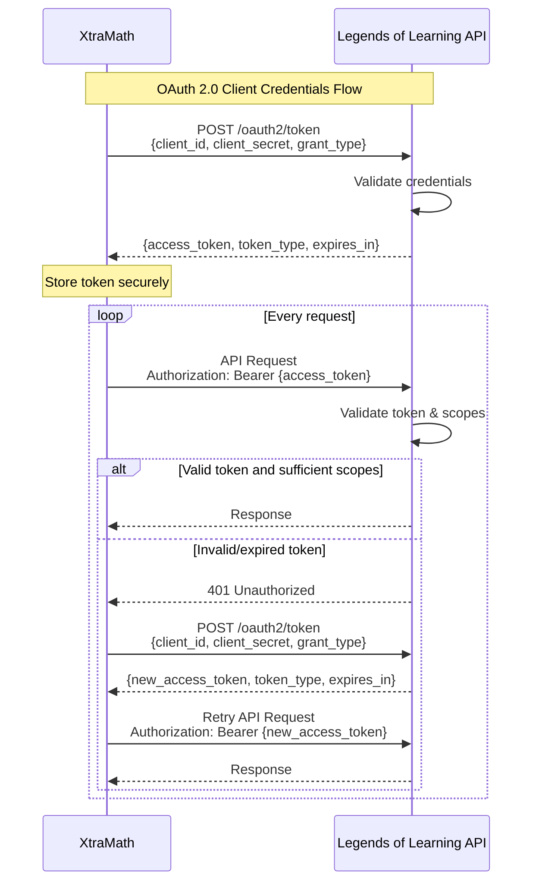
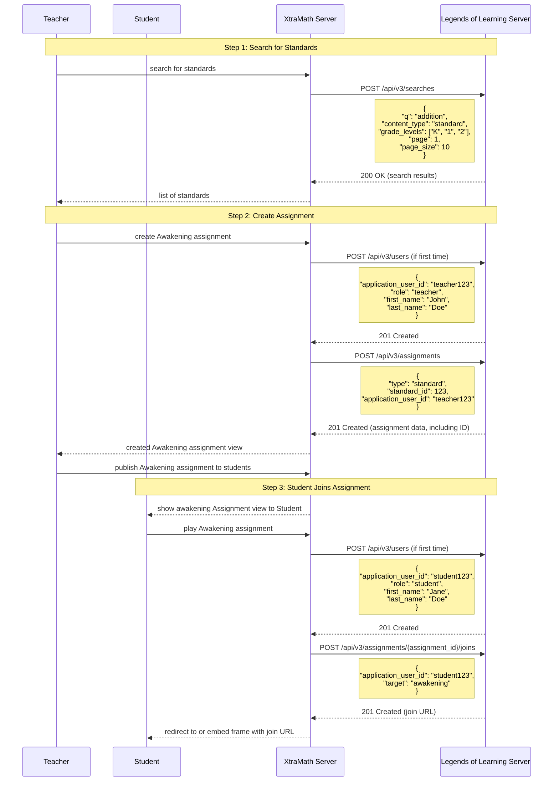

# Legends of Learning - XtraMath Integration

This document outlines the integration between Legends of Learning (LoL) and XtraMath platforms, covering security, authentication, and available APIs.

## Table of Contents
- [Getting Started](#getting-started)
   - [Application Registration](#application-registration)
   - [Authorization Flow](#authorization-flow)
- [Sample Scenario](#sample-scenario)
   - [Overview](#overview)
   - [Complete Flow](#complete-flow)
     - [Authorization Flow Diagram](#authorization-flow-diagram)
- [API Reference](#api-reference)
   - [OAuth](#oauth)
     - [`POST /api/v3/oauth2/token`](#POST-apiv3oauth2token)
     - [`POST /api/v3/oauth2/revoke`](#POST-apiv3oauth2revoke)
   - [Search](#search)
     - [`POST /api/v3/searches`](#POST-apiv3searches)
   - [Standards](#standards)
     - [`GET /api/v3/standard_sets`](#GET-apiv3standard_sets)
     - [`GET /api/v3/standard_sets/:id/standards`](#GET-apiv3standard_setsidstandards)
   - [Content](#content)
     - [`GET /api/v3/content`](#GET-apiv3content)
     - [`GET /api/v3/content/:id`](#GET-apiv3contentid)
     - [`GET /api/v3/content/:id/reviews`](#GET-apiv3contentidreviews)
   - [Users](#users)
     - [`GET /api/v3/users`](#GET-apiv3users)
     - [`POST /api/v3/users`](#POST-apiv3users)
     - [`GET /api/v3/users/:id`](#GET-apiv3usersid)
     - [`PUT /api/v3/users/:id`](#PUT-apiv3usersid)
   - [Assignments](#assignments)
     - [`POST /api/v3/assignments`](#POST-apiv3assignments)
     - [`POST /api/v3/assignments/:id/joins`](#POST-apiv3assignmentsidjoins)

## Getting Started

### Application Registration

In order to use the API, an application must be registered.

1. Contact the Legends of Learning team to register your application with the following information:
   - Application name
   - Redirect URL (if applicable)
2. Obtain credentials from Legends of Learning:
   - Client ID
   - Client Secret (⚠️ Keep secure, never expose in client-side code)

### Authorization Flow

The integration uses OAuth 2.0 with Client Credentials flow, ensuring secure
communication between platforms. Each application receives its own set of
credentials and can only access its own users and data.

1. Get access token:
   ```http
   POST /api/v3/oauth2/token
   Content-Type: application/x-www-form-urlencoded
   Accept: application/json
   
   grant_type=client_credentials&
   client_id=YOUR_CLIENT_ID&
   client_secret=YOUR_CLIENT_SECRET
   ```

   Response:
   ```json
   {
     "access_token": "YOUR_ACCESS_TOKEN",
     "token_type": "bearer",
     "expires_in": 3600
   }
   ```

2. Use token in API requests:
   ```http
   GET /api/v3/content
   Authorization: Bearer YOUR_ACCESS_TOKEN
   ```

#### Authorization Flow Diagram



## Sample Scenario

### Overview

The Assignment API provides endpoints for creating assignments and generating join URLs for students:
1. Create an assignment
2. Generate join URLs for student access

### Complete Flow



## API Reference

### OAuth

#### <span style="color: #F07000;">POST</span> /api/v3/oauth2/token

##### Description

This endpoint is used to obtain an OAuth 2.0 access token for the Legends of Learning API.

##### Example

```http
POST /api/v3/oauth2/token
Content-Type: application/x-www-form-urlencoded
Accept: application/json

grant_type=client_credentials&
client_id=YOUR_CLIENT_ID&
client_secret=YOUR_CLIENT_SECRET
```

```json
{
  "access_token": "YOUR_ACCESS_TOKEN",
  "token_type": "bearer",
  "expires_in": 3600
}
```

##### Body

| Parameter | Type | Required | Description |
|-----------|------|----------|-------------|
| client_id | string | Yes | The client ID provided during application registration |
| client_secret | string | Yes | The client secret provided during application registration |
| grant_type | string | Yes | Must be set to "client_credentials" for this flow |

##### Response

HTTP/1.1 200 OK

| Field | Type | Description |
|-----------|------|-------------|
| access_token | string | The access token |
| token_type | string | The type of token (always "bearer") |
| expires_in | integer | The number of seconds the token will remain valid |

#### <span style="color: #F07000;">POST</span> /api/v3/oauth2/revoke

##### Description

This endpoint is used to revoke an OAuth 2.0 access token.

##### Example

```http
POST /api/v3/oauth2/revoke
Authorization: Bearer YOUR_ACCESS_TOKEN
Accept: application/json
```

```json
{}
```

##### Body

| Parameter | Type | Required | Description |
|-----------|------|----------|-------------|
| token | string | Yes | The token to revoke |

##### Response

HTTP/1.1 200 OK

The response is an empty JSON object.

### Search

#### <span style="color: #F07000;">POST</span> /api/v3/searches

##### Description

This endpoint is used to search for standards.

##### Example

```http
POST /api/v3/searches
Authorization: Bearer YOUR_ACCESS_TOKEN
Content-Type: application/json
Accept: application/json

{
  "q": "addition",
  "content_type": "standard",
  "grade_levels": ["K", "1", "2"],
  "page": 1,
  "page_size": 1
}
```

```json
{
  "total_count": 20,
  "page": 1,
  "hits": [
    {
      "data": {
        "content_type": {
          "id": 4086,
          "name": "Addition and Subtraction Word Problems",
          "description": "Solve addition and subtraction word problems, and add and subtract within 10, e.g., by using objects or drawings to represent the problem.",
          "image": "4.NF.A.2",
          "standard": [
            "CCSS"
          ],
          "grades": [
            "k"
          ],
          "subject_area": [],
          "standard_code": "K.OA.A.2"
        }
      },
      "id": "f6c95fcd-0601-4f8c-86f5-871d8fe8f10c",
      "content_type": "standard",
      "highlights": [
        {
          "field": "name",
          "snippets": [],
          "indices": null
        },
        {
          "field": "learning_objective.name[CCSS]",
          "snippets": [],
          "indices": null
        },
        {
          "field": "learning_objective.description[CCSS]",
          "snippets": [],
          "indices": null
        }
      ]
    }
  ],
  "per_page": 1
}
```

##### Body

| Parameter | Type | Required | Description |
|-----------|------|----------|-------------|
| q | string | Yes | The search query |
| content_type | string | Yes | The content type to search for ("standard") |
| grade_levels | array | Yes | The grade levels to search for (e.g. ["K", "1", "2"], max grade level is "9") |
| page | integer | Yes | The page number to return |
| page_size | integer | No | The number of results per page (default is 10) |

##### Response

| Field | Type | Description |
|-----------|------|-------------|
| total_count | integer | The total number of results |
| page | integer | The page number |
| per_page | integer | The number of results per page |
| hits | array[hit] | The list of search results |

###### hit

| Field | Type | Description |
|-----------|------|-------------|
| data | object | The details of the search result; for standards, see [standard](#standard) |
| id | string | The ID of the search result |
| content_type | string | The content type of the search result (e.g. "standard") |
| highlights | array[highlight] | The parts of the search result that matched the query |

###### highlight

| Field | Type | Description |
|-----------|------|-------------|
| field | string | The field that matched the query |
| snippets | array[snippet] | HTML snippets for the highlighting what matched out of the field text; snippets are not always provided |
| indices | array[integer] | When the field is an array of strings, this is the index of the string that matched the query |

###### snippet

| Field | Type | Description |
|-----------|------|-------------|
| snippet | string | HTML text with highlights applied to the tokens that matched the query |
| matched_tokens | array[string] | The tokens that matched the query |

###### standard

This data resides under the key `content_type` within the `data` object.

| Field | Type | Description |
|-----------|------|-------------|
| id | string | The ID of the standard |
| name | string | The name of the standard |
| description | string | The description of the standard |
| image | string | A key name for retrieving an image representing the standard from Legends of Learning's content site |
| standard | array[string] | The standard sets that the standard belongs to (e.g. ["CCSS"]) |
| grades | array[string] | The grades that the standard belongs to (e.g. ["k", "1"]) |
| subject_area | array[string] | The subject areas that the standard covers (e.g. ["math", "science"]; this is not always populated) |
| standard_code | string | The code of the standard (e.g. "K.OA.A.2") |


### Standards

#### <span style="color: #00F070;">GET</span> /api/v3/standard_sets

##### Description

This endpoint is used to retrieve a list of standard sets.

##### Example

```http
GET /api/v3/standard_sets?per_page=2
Authorization: Bearer YOUR_ACCESS_TOKEN
Accept: application/json
```

```json
{
  "total_count": 53,
  "page": 1,
  "per_page": 2,
  "results": [
    {
      "id": "AL Math",
      "name": "Alabama Math",
      "subject_area": "math"
    },
    {
      "id": "AL Science",
      "name": "Alabama Science",
      "subject_area": "science"
    }
  ]
}
```

##### Parameters

| Parameter | Type | Required | Description |
|-----------|------|----------|-------------|
| per_page | integer | No | The number of results per page (default is 10) |
| page | integer | No | The page number to return (default is 1) |
| subject_area | string | No | The subject area to filter by (e.g. "math", "science") (default is all subject areas) |

##### Response

| Field | Type | Description |
|-----------|------|-------------|
| total_count | integer | The total number of results |
| page | integer | The page number |
| per_page | integer | The number of results per page |
| results | array[standard_set] | The list of standard sets |

###### standard_set

| Field | Type | Description |
|-----------|------|-------------|
| id | string | The ID of the standard set |
| name | string | The display name of the standard set |
| subject_area | string | The subject area of the standard set |

#### <span style="color: #00F070;">GET</span> /api/v3/standard_sets/:id/standards

##### Description

This endpoint is used to retrieve a list of standards for a given standard set.


### Content

#### <span style="color: #00F070;">GET</span> /api/v3/content

#### <span style="color: #00F070;">GET</span> /api/v3/content/:id

#### <span style="color: #00F070;">GET</span> /api/v3/content/:id/reviews

### Users

#### <span style="color: #00F070;">GET</span> /api/v3/users

#### <span style="color: #F07000;">POST</span> /api/v3/users

#### <span style="color: #00F070;">GET</span> /api/v3/users/:id

#### <span style="color: #F07000;">PUT</span> /api/v3/users/:id

### Assignments

#### <span style="color: #F07000;">POST</span> /api/v3/assignments

#### <span style="color: #F07000;">POST</span> /api/v3/assignments/:id/joins


### Assignment Creation

When creating an assignment:
- Creates a mastery-type awakening activity
- Associates it with the specified standard
- Sets up a classic playlist mode assignment
- Default duration is 7 days from creation
- Assignment name is generated from the standard's learning objective

### Join URL Generation

The join URL system:
- Creates unique tokens for each student-assignment combination
- Stores join data in Redis with 24-hour TTL
- Join token data includes:
  - User ID
  - Assignment ID
  - Target platform

### Error Handling

1. **HTTP Status Codes**
   - 201: Created (successful creation)
   - 403: Forbidden (insufficient permissions)
   - 404: Not Found (assignment not found)
   - 422: Unprocessable Entity (validation errors)

2. **Error Response Format**
   ```json
   {
     "error": "Detailed error message"
   }
   ```
   or for validation errors:
   ```json
   {
     "errors": {
       "field": "error message"
     }
   }
   ```

3. **Common Error Scenarios**
   - Standard not found
   - User not found
   - Invalid target value
   - Missing required parameters
   - Insufficient permissions
   - Assignment not found

### Authentication and Security

1. **Authentication Requirements**
   - OAuth2 Bearer token required
   - Application context preserved
   - User must exist in the system

2. **Required Scopes**
   - `assignments:write` for creating assignments
   - `assignment_joins:write` for creating join URLs

### Implementation Notes

1. **Assignment Creation**
   ```json
   {
     "name": "Focus on Standard Name",
     "description": "Standard focus mode for Standard Name",
     "mode": "classic_playlist",
     "start_time": "2024-03-07T00:00:00Z",
     "end_time": "2024-03-14T00:00:00Z",
     "activities": [
       {
         "type": "awakening_activity",
         "learning_objective_id": 123,
         "order": 0
       }
     ]
   }
   ```

2. **Join URL Format**
   ```
   {base_url}/v3/join/{token}
   ```
   where token is a Base64-encoded random string

3. **Redis Storage**
   - Key format: `join_{token}`
   - TTL: 24 hours
   - Stored data:
     ```json
     {
       "user_id": 123,
       "assignment_id": 456,
       "target": "awakening"
     }
     ```

## API Reference

### Base URLs and Authentication

All API endpoints, including OAuth endpoints, are under `/api/v3`:

1. **OAuth Endpoints** - `/api/v3/oauth2/*`
   - Authentication and token management
   - No authentication required
   - Examples:
     - `/api/v3/oauth2/token` - Token generation
     - `/api/v3/oauth2/revoke` - Token revocation

2. **Resource Endpoints** - `/api/v3/*`
   - All other functionality
   - Requires OAuth 2.0 Bearer token
   - Examples:
     - `/api/v3/content`
     - `/api/v3/users`
     - `/api/v3/searches`

### Authentication Flow

The API uses two distinct pipelines:

1. **OAuth Pipeline** (`/api/v3/oauth2/*`)
   - Token generation and revocation
   - Basic JSON parsing
   - No authentication required

2. **API Pipeline** (`/api/v3/*`)
   - Basic JSON parsing
   - OAuth 2.0 Bearer token verification
   - Authentication validation
   - Application context validation

### Scope System

The API implements a hierarchical scope system:

Base Scope:
- `public:read` (automatically included in all tokens)

Permission Hierarchy:
```
api:access → access → write → read
```

Available Resource Scopes:
```elixir
@resources ~w(api test content reviews standards assignments assignment_joins users)
```

Each resource follows the permission hierarchy. For example:
- `content:read` - Basic content access
- `content:write` - Content modification (implies read)
- `content:access` - Full content access (implies write and read)

### Content API
Base URL: `/api/v3/content`
Required Scope: `content:read`

#### Content Types
Content type is determined by the following logic:
```elixir
CASE
  WHEN content_type = 'simulation' THEN 'simulation'
  WHEN content_type = 'video' THEN 'video'
  WHEN question_game = true THEN 'question'
  ELSE 'instructional'
END
```

#### Endpoints

1. **List Content**
```http
GET /api/v3/content
```

Query Parameters:
| Parameter | Type | Default | Description |
|-----------|------|---------|-------------|
| page | integer | 1 | Page number |
| page_size | integer | 20 | Items per page |
| standard_ids | array[integer] | null | Filter by standards |
| game_type | string | null | Filter by type (simulation, video, question, instructional) |
| content_type | string | null | Filter by raw content type |
| supports_tts | boolean | null | Filter by TTS support |
| supports_ipad | boolean | null | Filter by iPad support |
| multi_language | boolean | null | Filter by language support |
| saves_progress | boolean | null | Filter by progress saving |
| ids | array[integer] | null | Filter by specific IDs |

Response:
```json
{
  "entries": [
    {
      "id": "integer",
      "game": "string",
      "image": "string",  // Prefixed with CDN base URL
      "description": "string",
      "estimated_duration": "integer",
      "type": "string",
      "content_type": "string",
      "supports_ipad": "boolean",
      "supports_tts": "boolean",
      "video_preview_url": "string",
      "version": {
        "id": "integer",
        "url": "string",
        "language_key": "string",
        "api_version": "string"
      },
      "audience": {
        "g1": "boolean",
        "g2": "boolean",
        // ... through g12 and k
      },
      "banner": "string",
      "stat": {
        "teacher_rating_avg": "float",
        "teacher_rating_count": "integer",
        "student_rating_avg": "float",
        "student_rating_count": "integer",
        "ease_of_play_avg": "float",
        "content_integration_avg": "float",
        "composite_rating_score": "float",
        "composite_rating_avg": "float",
        "suggested_use_summary": "string"
      }
    }
  ],
  "page_number": "integer",
  "page_size": "integer",
  "total_pages": "integer",
  "total_entries": "integer"
}
```

2. **Get Content Details**
```http
GET /api/v3/content/:id
```

Response includes all fields from list endpoint plus:
```json
{
  "is_available": "boolean",
  "vocabulary": ["string"],
  "pdf_url": "string",
  "is_question_game": "boolean",
  "game_developer_id": "integer",
  "discussion_questions_after": ["string"],
  "discussion_questions_before": ["string"],
  "video": "string",
  "supports_spanish": "boolean",
  "instructions": "string",
  "short_name": "string",
  "sponsorship_image_url": "string",
  "sponsorship_link_url": "string",
  "developer_instructions": "string",
  "lexile_level": "string",
  "saves_progress": "boolean",
  "learning_objectives": [
    {
      "id": "integer",
      "ngss_dci_name": "string",
      "learning_objective": "string",
      "image_key": "string"
    }
  ],
  "concepts": [
    {
      "concept": "string",
      "concept_ident": "string"
    }
  ]
}
```

3. **Get Content Reviews**
```http
GET /api/v3/content/:id/reviews
```
Required Scope: `content_reviews:read`

Query Parameters:
| Parameter | Type | Default | Description |
|-----------|------|---------|-------------|
| page | integer | 1 | Page number |
| page_size | integer | 20 | Items per page |

Response:
```json
{
  "entries": [
    {
      "id": "integer",
      "score": "float",
      "review": "string",
      "created_at": "datetime",
      "teacher": {
        "id": "integer",
        "name": "string"
      },
      "tester_display_name": "string",
      "upvotes_count": "integer"
    }
  ],
  "page_number": "integer",
  "page_size": "integer",
  "total_pages": "integer",
  "total_entries": "integer",
  "stats": {
    "teacher_rating_avg": "float",
    "teacher_rating_count": "integer",
    "student_rating_avg": "float",
    "student_rating_count": "integer",
    "composite_rating_avg": "float",
    "composite_rating_score": "float",
    "teacher_rating_score_summary": "object",
    "student_rating_score_summary": "object",
    "ease_of_play_avg": "float",
    "content_integration_avg": "float",
    "suggested_use_summary": "string"
  }
}
```

Error Responses:
- 404: Content not found
  ```json
  {
    "error": "Content not found"
  }
  ```

### Assignment Management
Base URL: `/api/v3/assignments`
Required Scope: `assignments:write`

#### Endpoints

1. **Create Assignment**
```http
POST /api/v3/assignments
```

Request Body:
```json
{
  "type": "standard",
  "standard_id": "integer",
  "application_user_id": "string"
}
```

Response (201 Created):
```json
{
  "assignment_id": "integer"
}
```

2. **Join Assignment**
```http
POST /api/v3/assignments/:id/joins
```
Required Scope: `assignment_joins:write`

Request Body:
```json
{
  "application_user_id": "string"
}
```

### User Management
Base URL: `/api/v3/users`

#### Endpoints

1. **List Users**
```http
GET /api/v3/users
```
Required Scope: `users:read`

Query Parameters:
| Parameter | Type | Description |
|-----------|------|-------------|
| role | string | Filter by "student" or "teacher" |
| application_user_id | string | Filter by external user ID |

2. **Create User**
```http
POST /api/v3/users
```
Required Scope: `users:write`
Note: OPTIONS endpoint disabled for this route

Request Body:
```json
{
  "application_user_id": "string",
  "first_name": "string",
  "last_name": "string",
  "email": "string",
  "role": "string"
}
```

3. **Get User**
```http
GET /api/v3/users/:id
```
Required Scope: `users:read`

4. **Update User**
```http
PUT /api/v3/users/:id
```
Required Scope: `users:write`
Note: OPTIONS endpoint disabled for this route

### Standards Management
Base URL: `/api/v3/standard_sets`

### Search API
Base URL: `/api/v3/searches`
Required Scope: `searches:write`

#### Endpoints

1. **Global Search**
```http
POST /api/v3/searches
```

Request Body:
```json
{
  "q": "string",
  "content_type": "game|video|standard",
  "game_types": ["instructional", "quiz", "simulation"],
  "grade_levels": ["K", "1", "2", "3", "4", "5", "6", "7", "8", "9", "10", "11", "12"],
  "subject_areas": ["math", "science"],
  "standard_set": "string",
  "max_lexile_level": "integer",
  "page": "integer",
  "page_size": "integer"
}
```

Parameters:
| Parameter | Type | Default | Description |
|-----------|------|---------|-------------|
| q | string | "" | Search query term |
| content_type | enum | "game" | Type of content to search for (game, video, standard) |
| game_types | array[enum] | [] | Filter by game types (instructional, quiz, simulation) |
| grade_levels | array[enum] | [] | Filter by grade levels (K, 1-12) |
| subject_areas | array[enum] | [] | Filter by subject areas (math, science) |
| standard_set | string | null | Filter by standard set |
| max_lexile_level | integer | null | Maximum lexile level |
| page | integer | 1 | Page number |
| page_size | integer | 10 | Items per page |

Response:
```json
{
  "hits": [
    {
      "content_type": "game",
      "id": "integer",
      "data": {
        "content_type": {
          "id": "integer",
          "name": "string",
          "description": "string",
          "thumbnail_url": "string",
          "grade_levels": ["string"],
          "subject_areas": ["string"],
          "game_type": "string",
          "content_type": "string",
          "lexile_level": "string"
        }
      },
      "highlights": {
        "field": "string",
        "snippets": [
          {
            "snippet": "string",
            "matched_tokens": ["string"]
          }
        ],
        "indices": ["integer"]
      }
    }
  ],
  "total_count": "integer",
  "page": "integer",
  "per_page": "integer"
}
```

Error Responses:
- 422: Invalid parameters
  ```json
  {
    "error": {
      "message": "Invalid parameters provided",
      "details": {
        "unexpected_parameters": ["parameter_name"]
      }
    }
  }
  ```